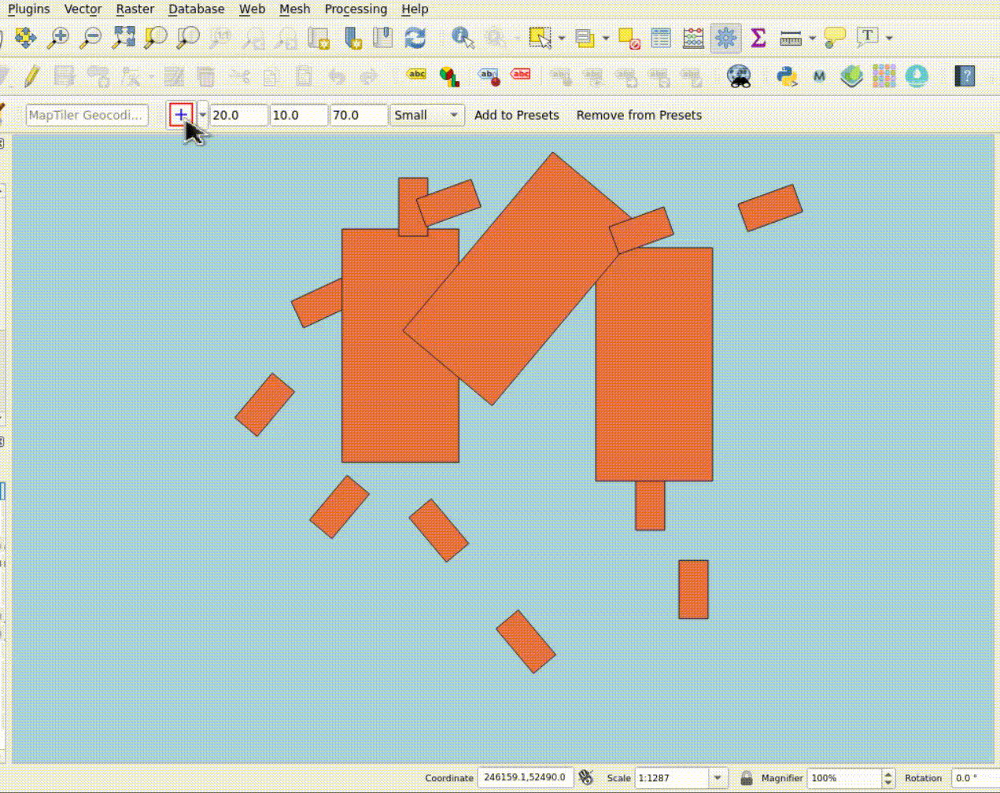

# QuickRectangleCreator - Qgis plugin
QuickRectangleCreator allows you to create a polygon (rectangle) with the specified width, length on the rotation. 
The added object is visible in the map window in real time. Clicking adds the object to the selected layer in the layer tree. 
Important! The selected layer must be of type: polygon. If you try to add an object to, for example, 
a point layer, an error message will be displayed. Polygon dimensions are treated as mapping units in which the map is currently rendered.

